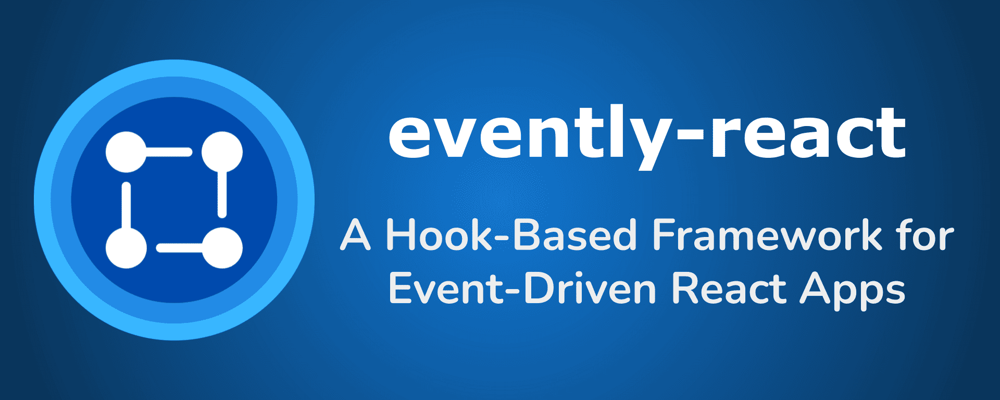

<div align="center">

# evently-react

</div>

 



## 🎉 Overview

`evently-react` simplifies event management for React developers. 🚀

Whether you're building a small app or a large-scale application, this package offers a clean and simplified design to manage robust and scalable event-driven architectures.

With its **hooks-based API**, `evently-react` enables seamless event handling while keeping your codebase clean and maintainable.

Say goodbye to prop drilling and global state chaos and hello to elegant, event-driven designs! 🎯

---

## ⚡ Features

- 💡 **Hooks-based API**: Simplifies event management with `useSubscribe` and `useEvent`.
- 🧩 **In-memory Caching**: Supports late subscribers without missing events.
- 🔗 **Middleware Support**: Modify or intercept event payloads seamlessly.
- 📂 **Typed Events**: Built-in TypeScript support ensures type safety.
- ⚙️ **Non-React Compatibility**: Use exported `EventBus` class for other environments.

---

## 🚀 Getting Started

### 1️⃣ Installation

Install the package using npm or yarn:

```bash
npm install evently-react
# OR
yarn add evently-react
```

### 2️⃣ Quickstart Example

Below is a quick example to get started with `evently-react`.

```tsx
import React from 'react'
import { EventProvider, useEvent, useSubscribe } from 'evently-react'

// Define a publisher component
const Publisher: React.FC = () => {
  const { emitEvent } = useEvent()

  const handleClick = () => {
    emitEvent('greet', { message: 'Hello from Publisher!' }) // Emit an event
  }

  return <button onClick={handleClick}>Send Greeting</button>
}

// Define a subscriber component
const Subscriber: React.FC = () => {
  useSubscribe('greet', payload => {
    console.log(payload.message) // Log the event payload
  })

  return <p>Listening for greetings...</p>
}

// Wrap your application with EventProvider
const App: React.FC = () => (
  <EventProvider>
    <Publisher />
    <Subscriber />
  </EventProvider>
)

export default App
```

---

## 🔧 Usage

### 1️⃣ Emitting Events

Use the `useEvent` hook to emit events:

```tsx
import React from 'react'
import { useEvent } from 'evently-react'

const EmitExample: React.FC = () => {
  const { emitEvent } = useEvent()

  const handleClick = () => {
    emitEvent('exampleEvent', { message: 'Hello, Evently!' }) // Emit an event with a payload
  }

  return <button onClick={handleClick}>Emit Event</button>
}

export default EmitExample
```

### 2️⃣ Subscribing to Events

Use the `useSubscribe` hook to listen to events:

```tsx
import React from 'react'
import { useSubscribe } from 'evently-react'

const SubscribeExample: React.FC = () => {
  useSubscribe('exampleEvent', payload => {
    console.log('Received payload:', payload) // Logs: { message: 'Hello, Evently!' }
  })

  return <p>Listening for events...</p>
}

export default SubscribeExample
```

---

## 💡 Advanced Features

### Middleware 🛠️

Middleware allows you to intercept or transform events before they are processed.

There are 2 types of middlewares supported: Global and Event-specific.

#### Global Middleware: `.use()`

```tsx
import { useEvent } from 'evently-react'

const App = () => {
  const { eventBus } = useEvent()

  eventBus.use((event, payload) => {
    console.log(`Global Middleware: ${event}`)
    return { ...payload, eventSeen: true }
  })

  return <div>Your App</div>
}
```

#### Event-Specific Middleware: `.useForEvent()`

```tsx
eventBus.useForEvent('myEvent', (event, payload) => {
  console.log(`Event middleware for ${event}`)
  return { ...payload, transformed: true }
})
```

### In-Memory Caching 📦

Late subscribers can still receive the latest events:

```tsx
useSubscribe('exampleEvent', payload => {
  console.log('Late subscriber received:', payload) // Works even if the event was emitted earlier
})
```

---

## 💡 Tips

- 🎯 Use meaningful event names to keep your event flow intuitive.
- 💾 Middleware can be a powerful way to enforce validation or transformations across events.
- ⚙️ Use in-memory caching to ensure real-time updates for dynamic UIs.
- 🧩 Combine `evently-react` with React context or Redux for hybrid state/event management solutions.
- 📦 Explore lazy-loaded modules to reduce initial app load while still utilizing events.

---

## 📝 FAQs

### 1️⃣ What is a real-world use case for `evently-react`?

- **Cross-Component Communication**: Emit an event in one component and listen in another without prop drilling.
- **Global Notifications**: Show toast notifications across your app.
- **Dynamic Data Updates**: Trigger real-time UI updates based on backend events.

### 2️⃣ Can I use `evently-react` in non-React environments?

- **Yes!** You can use the exported `EventBus` class instance to integrate event-based communication in non-React environments. All methods like `emit`, `subscribe`, and middleware support are fully available.

### 3️⃣ Why isn’t my event handler being triggered?

- Ensure the event name matches exactly.
- Confirm the `useSubscribe` hook is called within a component wrapped by `EventProvider`.
- Check for typos in event names or payload structures.

### 4️⃣ Can I subscribe to multiple events in one component?

- Yes, simply call `useSubscribe` multiple times with different event names.

---

## 🛠️ Support & Suggestion

Having issues or have a suggestion?

- 🐛 [Report a Bug](https://github.com/tirth-2001/evently-react/issues/new?template=bug_report.md)
- 💡 [Request a Feature](https://github.com/tirth-2001/evently-react/issues/new?template=feature_request.md)
- 📚 [Join the Discussion](https://github.com/tirth-2001/evently-react/discussions)
